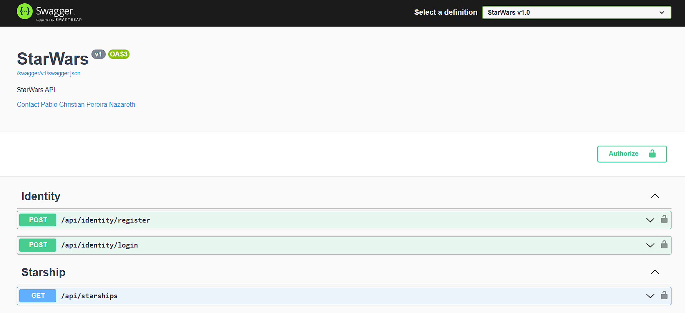
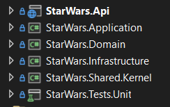

<h1 align="center">
⭐ Star Wars API ⭐ 
</h1>
Name: Pablo Christian Pereira Nazareth
💬 A Star Wars API integration application using C# dotnet. This is a coding challenge.

## 👨‍💻 Code Challenge

#### 📌 Overview
Using the StarWars API (https://swapi.dev) create a simple web app containing a `<select>` input to allow a user to select a Starship `manufacturer`.
In a `<table>` display a list of all Starships with the selected `manufacturer`. If no `manufacturer` is selected display all starships in the table.
At DeveloperTown we primarily use React to build web applications but you can use any front-end JavaScript framework you’d like (React, Angular, Vue, Svelte, etc).

Notes:
The final result will not be evaluated on visual style, so you do not need to spend time styling (browser defaults are just fine) unless you want to.
A javascript library exists for the StarWars API. We request that you do not use the javascript library to interact with the StarWars API
NPM packages other than the StarWars API can be used but are not required to complete this assignment.

## 📑 Demonstrations
Swagger documentation showing the application API routes:

## 💻 Technologies and Patterns
These are all the technologies and patterns used to develop this application
##### BackEnd
- [C# .NET 6.0 Web API](https://dotnet.microsoft.com/en-us/download/dotnet/6.0)
- [MediatR](https://www.nuget.org/packages/MediatR)
- [FluentValidation](https://www.nuget.org/packages/FluentValidation)
- [AutoMapper](https://www.nuget.org/packages/AutoMapper)
- [Xunit](https://www.nuget.org/packages/xunit)
- [FluentAssertions](https://www.nuget.org/packages/FluentAssertions)
- [Moq](https://www.nuget.org/packages/Moq)

Patterns and Techniques:
- TDD (Test Driven Development)
- DDD (Domain Driven Design)
- CQRS (Command Query Responsibility Segregation)
- Middlewares: Error, Request and Response
- Dependency Injection
- Domain Notification
- Domain Message
- Domain Exception
- Domain Helper

## 🛠 Architecture
The project solution was based on DDD (Domain Driven Design) concept.

## Requirements

**Option 01: Outside Containers** 
If you want to run the project outside containers, you must also have the following:
- [.NET 6.0](https://dotnet.microsoft.com/en-us/download/dotnet/6.0)

## ⚙️ Executing the Project
To execute the project, follow the steps below:

#### Execution

**Option 01: Outside Containers**
1. Open the command prompt (cmd), navigate inside the project "\src" folder, and type: "run.bat"
2. This script will run the projects and open the browsers.

## 🤝 Critique
This section is used to self-critique to reflect and write what would be good to improve over time:

1. Performance:
	1. Cache service to store the lattest requests and posts for better performance.
2. Scalability:
	1. Use of AWS ECS (Elastic Container Service) or EKS (Elastic Kubernetes Service) to manage the Docker Containers.
	2. Use of AWS Auto Scaling to manage scalability of instances by CPU usage. (Above 70% CPU usage would create new instance).
3. Load Balancing:
    1. Use of AWS Load Balancer to balance the requests between the containers (active instances).
4. Security:
	1. Use of .NET Identity to manage user authentication for security.
	2. Implement token JWT and use of claims to manager user permissions.
5. Tests
	1. Implement remaining tests left for the other classes.
	2. Implement integration tests to test end-to-end requests.
	3. Implement K6 to execute load tests so we can monitor our application to see if its going to be able to handle the expected number of users and requests per second.